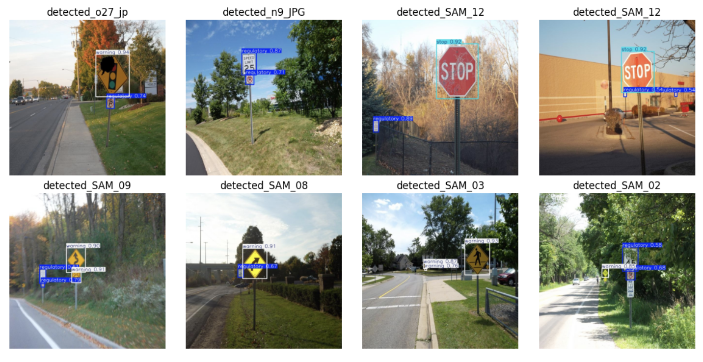
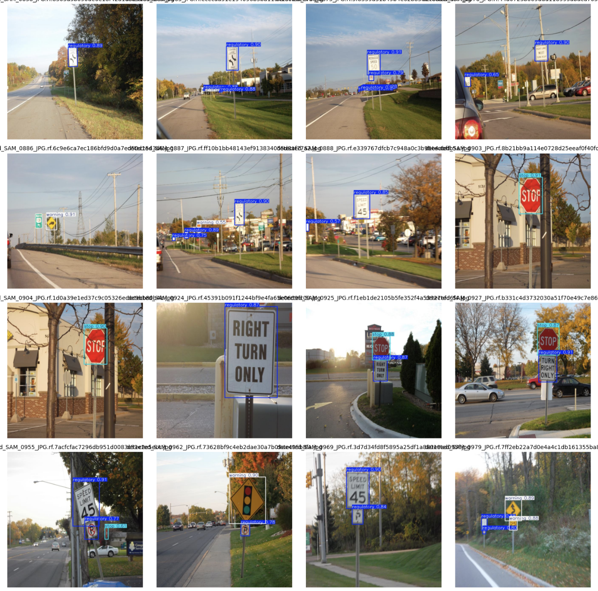
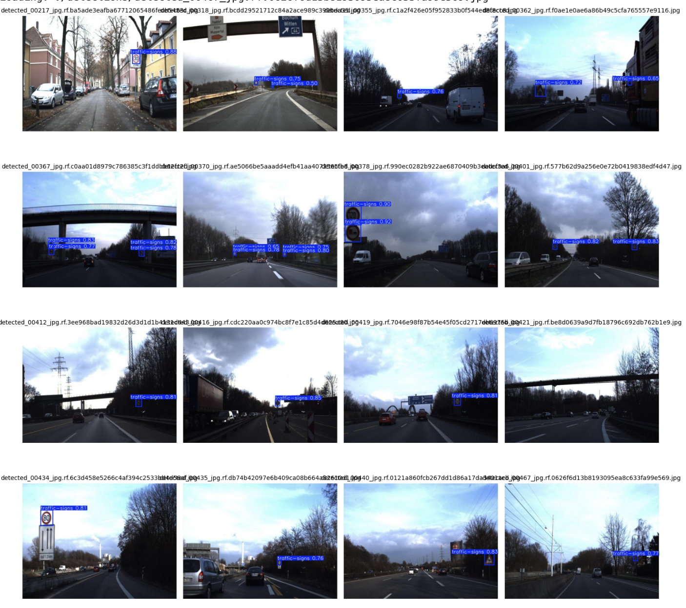
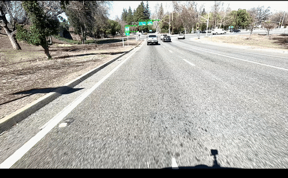

# YOLO Small Object Detection Project

## Group Members
- **Vishruth Byaramadu Lokesh**
- **Zeba Samiya**
- **Himanshu Singh Rao**
- **Akshay Aralikatti**

## Project Overview
This project focuses on detecting small objects, specifically traffic signs, using the YOLO (You Only Look Once) object detection model. Detecting small objects is a challenging task due to their minimal pixel representation in images, and our goal was to optimize YOLO for improved performance in this scenario.

We conducted multiple trials to refine the detection accuracy and experimented with different techniques to enhance detection capabilities. The project is divided into four separate trials, each contained in its own folder.

## Project Structure
The repository consists of the following folders:

- **Trial 1**
- **Trial 2**
- **Trial 3**
- **Trial 4**

Each trail represents different stages of the project with varying model configurations, training datasets, and hyperparameter tuning. For more detailed information about each trial, open the respective folder and read its `README.md` file.

---

## Results

### Trial 1 Results

### Trial 2 Results

### Trial 3 Results

### Trial 4 Results

[Click on this to watch the Trail 4 full video](https://drive.google.com/file/d/165KVw9jAVlE1iifRTnoxAZFvMEMayve8/view)

Each of these images represents the detection performance for that specific trial.

For a detailed breakdown of each trial's approach, results, and challenges, refer to the `README.md` file inside each respective trial folder.

---

## Conclusion
Through these experiments, we gained insights into small object detection using YOLO and explored techniques to enhance detection accuracy for traffic signs. Our findings contribute towards improving real-world applications such as autonomous driving and smart traffic monitoring.

